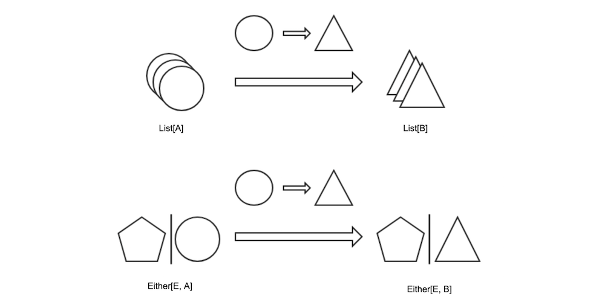
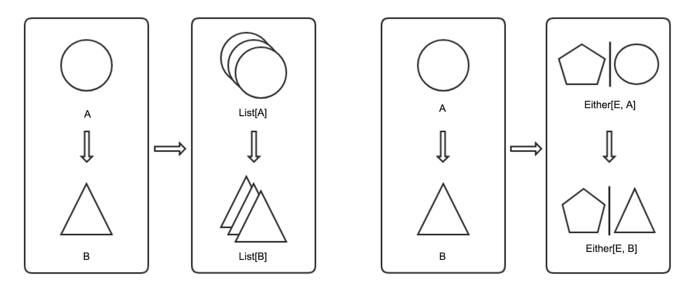

# 什么是Functor

熟悉了高阶类型之后，Functor（函子）的概念都不难理解了。Functor本身是一种高阶类型，它描述类型构造器之间的映射。类型构造器可以视为可以盛装具体类型的容器（container），或者说，具体类型所处的环境、上下文（context)。如List[T]，是个装了T类型的列表型容器。我们不对这几种说法做区分。

除了前面的List、Set，常用的类型构造器还有：

* **Option** 可能有值，也可能没有值。
* **Either** 要么是左值，要么是右值。

Functor映射的是容器内盛装的内容，从类型A转化到了类型B，而容器本身保持不变。这个映射关系用map函数表达，假如，map能把圆圈映射成五角星，便可以用下图形象地描述Functor的作用：



代码上，Functor可以定义为：
```scala
scala> trait Functor[F[_]] {
           def map[A,B](fa: F[A], f: A=>B): F[B]
       }
defined trait Functor
```
其中，F是装了特定类型A的容器，map方法接受两个参数，一个装着A的容器，另一个是把A变成B的函数，输出装着B的容器。作用过程可以通俗地理解为把A从容器内取出，转换为B，再装回容器中。

横看成岭侧成峰，我们还可以换个视角观察，得到下面这张图：


从这个视角看很容易发现，包含了两个层面的映射：

* 类型的映射：A映射为`F[A]`。
* 函数的映射：A=>B映射为`F[A]=>F[B]`。

所以，Functor又可以定义为：
```scala
scala> trait Functor[F[_]] {
            def typeMap[A](a: A): F[A]
            def funcMap[A,B](f: A=>B): F[A]=>F[B]
       }
defined trait Functor
```
实际上，图中的每一个框都代表了一个数学上的**范畴**概念，有兴趣的读者可以自行做进一步了解。Functor定义的正是范畴之间的映射关系。下面我们造出新的构造器，并使用第一种Functor定义进行映射。

```scala
scala> case class Pair[A](first: A, second:A)
defined class Pair

scala> val functor = new Functor[Pair] {
            def map[A, B](fa: Pair[A])(f: A=>B):Pair[B] = Pair(f(fa.first), f(fa.second))
       }
functor: Functor[Pair] = $anon$1@c197f46

scala> functor.map(Pair(1, 2)){_ + 1}
res8: Pair[Int] = Pair(2,3)

```

scala并没有直接提供Functor，但在List、Set等很多类型构造器的定义中直接实现了map方法，间接提供了类似Functor的效果。

因为map并不改变容器的结构，List还是List，Either还是Either，便可以连续进行映射，形成map链，如：
```scala
scala> List(1, 2, 3).map{_ + 1}.map{_ * 2}.map{_ + "stars"}
res9: List[String] = List(4stars, 6stars, 8stars)
```

值得注意的是，Functor要保证无论是逐个执行这些函数，还是把它们组合成一个大函数，再一次性执行，最终的结果应该一样。为此，有两条定律要遵循：
* `fa.map(x => x) == fa`
* `fa.map(f).map(g) == fa.map(g(f(_)))`

回忆下Monoid，是不是觉得这两条定律分别和恒等函数和结合律很像？这并不是巧合。上面说到Functor是范畴之间的映射，范畴内的所有内容都被映射到目标范畴内，包括了类型、函数，和函数的特性，如恒等关系和结合律。

于是，不难理解为什么以下两个判断为真了。

```scala
scala> List(1, 2).map(x => x) == List(1, 2)
res10: Boolean = true

scala> List(1, 2).map(_ + 1).map(_ + "s") == List(1, 2).map(x => (x + 1) + "s")
res11: Boolean = true
```
