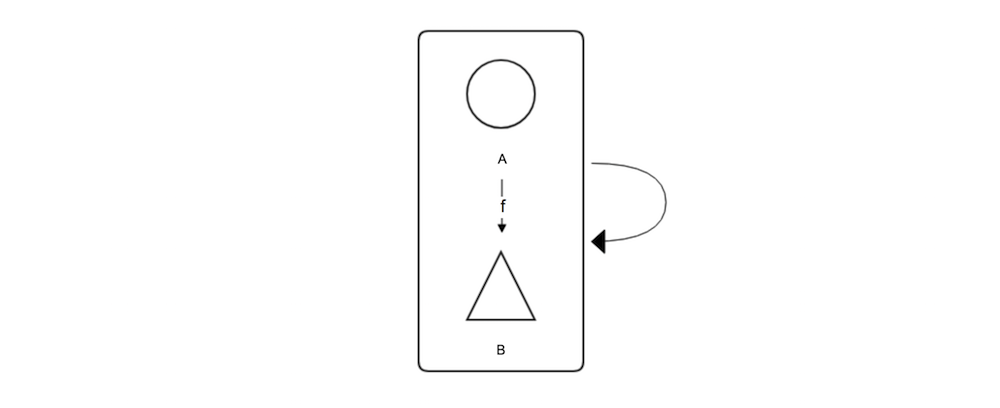
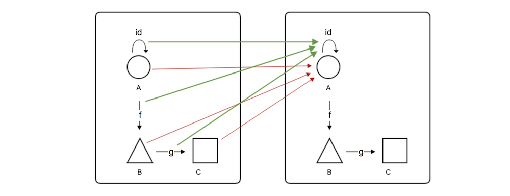

# 自己变成自己

函子和函数很像，它们有很多相同的性质。我们可以通过函数的性质来了解函子的性质。

Endofunction（自函数）把一个类型映射到自身类型，比如`Int => Int`, `String => String`等。 
而Functor描述两个范畴的映射关系，相应地，Endofunctor（自函子）便是把一个范畴映射到自身范畴的函子。



从上图可以看出，最简单的Endofunctor莫过于Identity函子了，A还是A，B还是B，函数`f：A => B`也保持不变。和endofunction类似，它不改变内部元素和关系，原样保持输入的范畴。

我们知道Identity函数，只是函数Endofunction的特例。比如，满足`Int => Int`有无数个函数，像`y=x^2`，`y=x+3`, `y=abs(x)`等等，甚至像`y=1`这种常量函数符合要求。但其identity函数是唯一的：
```scala
scala> def echo(x: Int): Int = x
echo: (x: Int)Int
```

相应地，不难理解Identity函子，也只是EndoFunctor的一个特例。模拟常量函数，构造一个常量函子作为例子：



为了便于阅读，把同一个范畴分成左右两个表示。红色箭头表示类型（元素）的映射，所有类型都映射到了同一个类型（圆圈）上；绿色箭头表示函数的映射，所有函数都映射到了这个类型的恒等函数上。显然，范畴内的恒等关系、结合律关系在映射前后保持不变，这是一个Functor。又因为它们是同一个范畴，所以这是个Endofunctor。如果你对类型b、c以及函数f和g没有被覆盖而疑惑的话，想想y=1吧，除了1，其它Int也都没被覆盖到，但你不会怀疑y=1是一个满足`Int => Int`的函数，对吧？

和函数类似，函子也有定义域（domain）、到达域（codomain)，和值域（range或image）的概念，值域并不一定要包含整个对应域。它们的关系可以简单用下图表示：


f是一个将所有定义域X（红色区块）中的点x∈X对应到点f(x)∈Y的函子。点f(x)的集合（黄色区块）为函子f的值域，Y（蓝色区块）为f的到达域。

