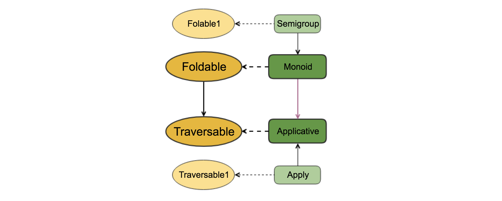

# 再次穿越火线

> 横看成岭侧成峰，远近高低各不同。——《题西林壁》

在Id的辅助下，Functor的map可以从traverse推导得到：
```scala
type Id[X] = X

def map[A, B](fa: F[A])(f: A => B): F[B] = traverse[Id, A, B](fa)(f)
```
事实上，Traverse就是Functor，这些Functor相应地称为traversable functor。scalaz等函数式编程库的Traverse就是从Functor拓展而来。也许你还记得foldable的map也可以从foldLeft推导得到，是否可以说Foldable也是Functor呢？答案是否定的。具体可以通过验证Functor的两条法则来判断（**如何证明？**）。

Functor的map一定保持容器结构不变，而Foldable既可以保持，也可以不保持。从这个意义上看，Foldable比Functor灵活，但也存在不属于Foldable的Functor，它们之间并无继承关系。而Traverse则同时是Functor和Foldable。三者的关系可以用下图表示：


那么Foldable的标志性方法foldLeft和foldRight，是否可以用traverse推导而来呢？

Foldable是对于给定的数据集合F[A]，和一个映射函数`A => B`，在B是Monoid的情况下，把该集合累积归并到单个B值；Traverse则是，对集合F[A]，和一个返回带某种"作用"（effect）的函数`A => G[B]`，在G是Applicative的情况下，组合所有"作用"。似乎是风马牛不相及的两个东西，而且从函数定义上看，traverse返回的是G[F[B]]，foldMap需要的却是B，怎么能统一起来呢？
```scala
trait Traverse[F[_]] {
    def traverse[G[_]: Applicative, A, B](fa: F[A])(f: A => G[B]): G[F[B]]

    def foldLeft[A, B: Monoid](fa: F[A], z: B)(op: (B, A) => B): B = foldMap(fa)(a => op(z, a))

    //如何用traverse推导得到？
    def foldMap[A, B: Monoid](fa: F[A])(f: A => B): B = ???
}
```
答案自然是可以的。推导过程一会儿再说，这个答案揭示的结论很有启发性。它穿针引线一般，让脑子里原本离得很远的两个概念有了关联。青出于蓝而胜于蓝，Traverse继承自Foldable，但比之更具一般性，可以保持结构不变，亦可去除结构后浓缩为一个值。

再来看如何推导。过程稍微有点繁琐，但用利于理解结论，我们还是耐心看看。由于foldLeft很容易用foldMap表示，因此，如果能用traverse推导出foldMap，推导foldLeft就是顺其自然的事了。

容器F是用户或具体场景给定的，无法改变，我们可以发挥的空间在于G。G描述的是某种作用，如果G是个Const，便可以去除该作用： `type Const[A, B] = A`。 又因为我们要的是B，而不是F[B]，顺理成章，应该把F[B]放在Const的第二个位置，B放在第一个位置，即A的位置上。Const可以想象成类型级别的常量函数，无论F[B]怎么变化，总是返回A，换句话说，Const[A, B]一定程度上可以视为A。

Traverse要求G是个Applicative，所以我们要为Const构造一个Applicative：
```scala
//step1. 用Const构建一个Applicative
implicit def constApplicative1[Z, ?]: Applicative[Const] =
new Applicative[Const[Z, ?]] {
  override def pure[A](a: => A): Const[A] = ???
  override def apply[A, B](fa: => Const[A])(f: => Const[A => B]): Const[B] = ???
}
```
G是关于Z一个类型参数的Applicative，但是Const需要两个类型参数，需要借助于type lambda完成二者的适配。其中，`({type f[x] = Const[Z, x]})#f`的f表示匿名类中的类型别名f。此外，上述代码还有很多错误需要解决，Const[A]不是合法的语句，显然我们要保留的Z应该在第一个位置，pure和apply原本的入参放置在第二个位置。
```scala
//step2. 参数适配
implicit def constApplicative2[Z]: Applicative[Const[Z, _]] =
new Applicative[({type f[x] = Const[Z, x]})#f] {
  override def pure[A](a: => A): Const[Z, A] = ???
  override def apply[A, B](fa: => Const[Z, A])(f: => Const[Z, A => B]): Const[Z, B] = ???
}
```
接下来要实现的是pure和apply的具体逻辑，注意到foldMap依赖的Monoid还没有被利用，此时正好派上用场。
```scala
//step3. z是个monoid，借之定义applicative
implicit def constApplicative3[Z: Monoid] =
new Applicative[({type f[x] = Const[Z, x]})#f] {
  override def pure[A](a: => A): Const[Z, A] = Monoid[Z].zero
  override def apply[A, B](fa: => Const[Z, A])(f: => Const[Z, A => B]): Const[Z, B] = Monoid[Z].combine(fa, f)
}
```
至此，我们成功地利用Monoid为Const定义了一个Applicative。还差最后一步，以这个constApplicative为桥梁，用traverse推导foldMap。foldMap有`A => B`，但traverse需要的是A => G[B]，因G是`Const，A => Const[B, _]`等同于`A => B`，我们不关心Const第二个位置，所以传没有任何值的Nothing。这样，G必须是关于Const[B, Nothing]的Applicative，但Const有两个类型参数，而Applicative构造器只接受一个类型，所以要再次借助于type lambda，完成桥接。
```scala
//step4.
trait MyTraverse[F[_]] {
    def traverse[G[_]: Applicative, A, B](fa: F[A])(f: A => G[B]): G[F[B]]
    def foldLeft[A, B: Monoid](fa: F[A], z: B)(op: (B, A) => B): B = foldMap(fa)(a => op(z, a))
    def foldMap[A, B: Monoid](fa: F[A])(f: A => B): B = traverse[({type f[x] = Const[B, x]})#f, A, Nothing](fa)(f)
}
```
大功告成！快让新鲜出炉的基于traverse的foldLeft出场秀一下吧：
```scala
scala> val listTraverse = new Traverse[List] {
           override def traverse[G[_] : Applicative, A, B](fa: List[A])(f: A => G[B]) = {
             val m = implicitly[Applicative[G]]
             fa.foldLeft(m.pure(List.empty[B])) { (accum, item) => m.apply2(accum, f(item))(_ :+ _) }
           }
    }
listTraverse: Traverse[List] = $anon$1@71268b8c

scala> listTraverse.foldLeft(List(1, 2, 3), 0)(_ + _)
res0: Int = 6
```
回顾一下，整个推导的关键点在于constApplicative，也许更恰当的名称是monoidApplicative，因为它完成了Monoid到Applicative的转换，发挥了枢纽性作用。从结构和形式上看，Applicative可以视为一种Monoid。啊哈，又是一个不经意间的关联。具体怎么理解呢？如果把二者的核心方法克里化，分别为：
* Monoid的combine：`m -> m -> m`。
* Applicative的apply：`f(a->b) -> f(a) -> f(b)`，忽略内容后，可以再精练为`f -> f ->f`。

看到了吧，二者在形式结构上完全一致。

最后，请后退一步，把眼光放到更大的视野上，关于Foldable、Traversable等几个概念，可以得出如下图所示的关系：

其中Traversable1和Apply的关系类似于Foldable1和Semigroup的关系，描述非空数据结构的情形。黑实线描述继承关系，紫实线描述上面讲的形式结构一致性，虚线描述的则是左侧Trait在实现上对右侧Trait的依赖关系。
