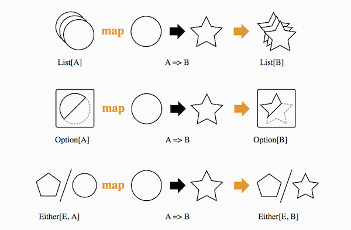

# 什么是Functor

Functor从名字上就给人和Function很像的映像。它们也确实很像，
Functor描述高阶类型之间的映射。

除了List，常见的上下文还有：

* **Option** 可能有值，也可能没有值。
* **Either** 要么是左值，要么是右值。

这种抽象可以形象地用下图表示，值发生了变化，但所处环境的结构不变。



因为结构不变，可以很方便地叠加多个运算。
```scala
scala> List(1, 2, 3).map{_ + 1}.map{_ * 2}.map{_ - 2}
res2: List[Int] = List(2, 4, 6)
```

Functor可以定义为：
```scala
scala> trait Functor[F[_]] { self =>
        def map[A, B](fa: F[A])(f: A => B): F[B]
     }
defined trait Functor
```
是对上下文环境内运算的抽象，可以通俗地理解为穿了外套的Function。Functor对环境内的值做映射，

其中，F代表了上下文环境，里面装了某种数据类型，我们并不关心它是什么类型，只是简单地定义了map方法，接受一个把A变成B的函数，便能把装着A的环境变成装着B的环境。
